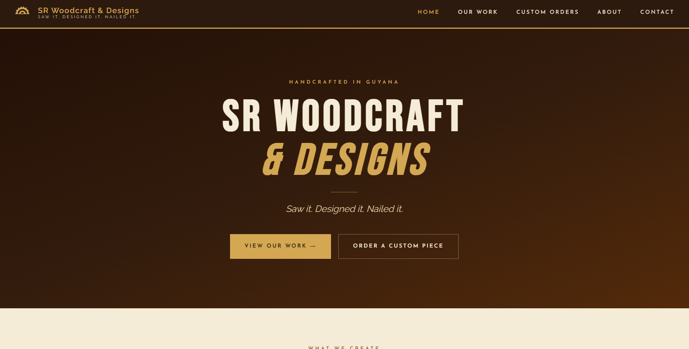
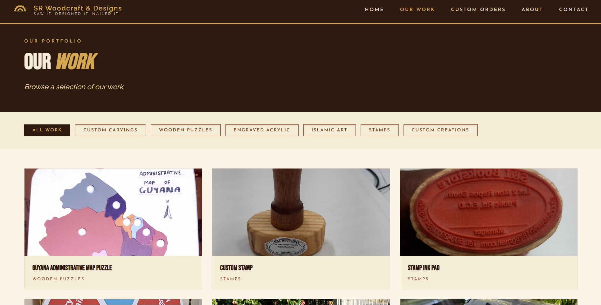
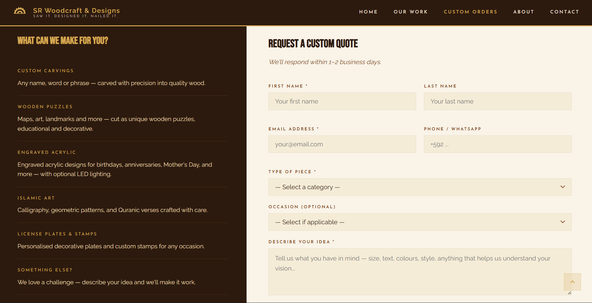
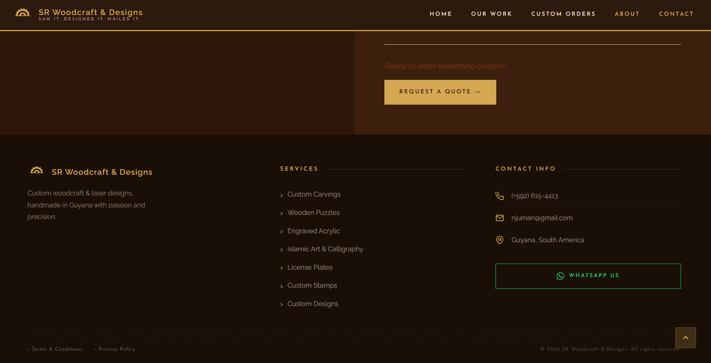

# SR Woodcraft & Designs

Official website for SR Woodcraft & Designs — a Guyanese woodcraft business specialising in custom handmade pieces including name carvings, map puzzles, acrylic light art, Islamic art, license plates, stamps and more.

## Live Demo
[sr-woodcraft-designs.netlify.app](https://sr-woodcraft-designs.netlify.app) 

Deployed with [Netlify](https://www.netlify.com)

## Screenshots
### Home

 
### Our Work

 
### Custom Orders

 
### Footer


---

## About

SR Woodcraft & Designs is a passion-driven woodcraft business based in Guyana. Every piece is handmade to order — measured, cut, shaped and finished by hand with care and attention to detail.

## Pages

- **Home** — hero section, product categories and FAQ
- **Our Work** — filterable photo gallery of completed pieces
- **Custom Orders** — quote request form for custom pieces
- **About & Contact** — business story and contact information

## Tech Stack

- HTML5
- CSS3 (custom, no framework)
- Vanilla JavaScript
- Component-based structure loaded via Fetch API

## Folder Structure

```
sr-woodcraft/
├── index.html
├── README.md
├── css/
│   └── styles.css
├── js/
│   └── main.js
├── components/
│   ├── nav.html
│   ├── home.html
│   ├── gallery.html
│   ├── custom-orders.html
│   ├── about.html
│   └── footer.html
└── images/
```

## Running Locally

This project uses the Fetch API to load components dynamically. Opening `index.html` directly in the browser will not work — you need a local server.

**Using VS Code:**
1. Install the Live Server extension
2. Open the project folder in VS Code
3. Right-click `index.html` and select Open with Live Server


## Contact

For custom orders or enquiries, visit the website or reach out via WhatsApp.

## License

All website code is open source. All woodcraft designs and product photos are the intellectual property of SR Woodcraft & Designs and may not be reproduced without permission.